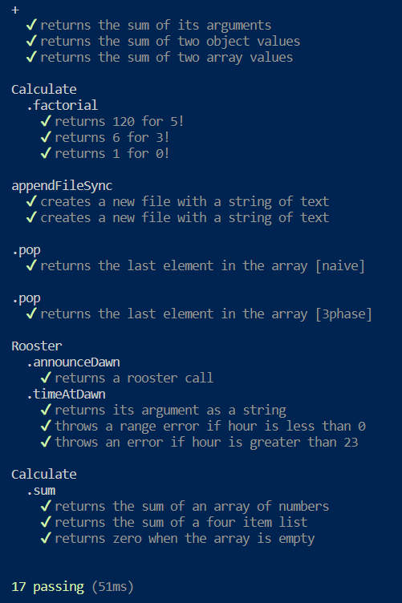

# Testing with Mocha.js ☕

<br />
<p align="center">
  <a href="https://github.com/jgome284/mocha-js">
    
  </a>

  <h3 align="center">Foreword</h3>

  <p align="center">
    A demo for unit testing with the Mocha.js framework.
    <br />
    <a href="https://github.com/jgome284/mocha-js/issues">Report Bug</a>
    ·
    <a href="https://github.com/jgome284/mocha-js/issues">Request Feature</a>
  </p>
</p>

## Table of Contents

- [Testing with Mocha.js ☕](#testing-with-mochajs-)
  - [Table of Contents](#table-of-contents)
  - [Setup](#setup)
  - [About](#about)
  - [Prerequisites](#prerequisites)
  - [Getting started](#getting-started)
  - [License](#license)

## Setup

This project includes a Dev Container for Visual Studio Code. It serves as a full-featured development environment with everything needed to run the test framework. Dev Containers separate tools, libraries, or runtimes needed for working with a codebase. They aid in continuous integration and testing. Dev containers can be run locally or remotely, in a private or public cloud, in a variety of supporting tools and editors.

[This DevContainer](.devcontainer) is built IAW the [DevContainers specification](https://containers.dev/implementors/spec/) and tailored for a development environment that runs Debian GNU/Linux 12 (bookworm). JavaScript dependencies are versioned in accordance with `package-lock.json` and project configurations are detailed in `package.json`. The devcontainer also has git for version control and several extensions installed for Visual Studio Code as IDE utilities.

<!-- ABOUT THE PROJECT -->
## About

[This project](https://github.com/jgome284/mocha-js) provides several [examples](./test/) of how to setup unit tests for JavaScript code. It leverages Mocha.js, is a widely adopted JavaScript testing framework that runs on both Node.js and in the browser. It’s highly regarded among developers for its versatility in testing applications across the front end and back end.

<!-- PREREQUISITES -->
## Prerequisites

To start, you need to have Docker Engine and Docker Compose on your machine. You can either:

- Install Docker Desktop which includes both Docker Engine and Docker Compose
- Install Docker Engine and Docker Compose as standalone binaries

This devcontainer is setup for development on Visual Studio Code. You should have it installed along with the [remote development pack](https://marketplace.visualstudio.com/items?itemName=ms-vscode-remote.vscode-remote-extensionpack) to enable the IDE's DevContainers functionality.

<!-- GETTING STARTED -->
## Getting started

First, git clone this project to a local repository. Then, open Docker Desktop to run the Docker daemon, a background process that manages and coordinates Docker containers on your system. On VS Code, open your local copy of the project and start the development container by running `Dev Containers: Rebuild and Reopen In Container` in the command palette. It can be accessed with the keyboard shortcut `ctrl + shift + P` on your keyboard.

When the Dev Container launches successfully, install Mocha.js along with its dependencies via npm by executing the following command. If successful, a `node_modules` folder should appear in your directory.

```sh
npm install
```

With dependencies installed, try running tests with Mocha! Our `package.json` file includes the right script to run all our tests. It's aliased to the following command via npm as such.

```sh
npm test
```

If successful, you should see the following output from Mocha.js for the tests. With so many tests, the value of automated testing becomes especially apparent. Manual re-runs during development can be imperfect, and they can lead to missed test cases. Automated testing helps catch issues early, ensuring code quality and reliability.

<h4 align="center"> Test Output</h4>
<p align="center">

</p>

Think you've got what it takes? Take testing with Mocha.js into your own hands and improve on what these tests offer by expanding test cases into the edge! (⌐■_■)

## License

Distributed under the MIT License. See `LICENSE` for more information.
